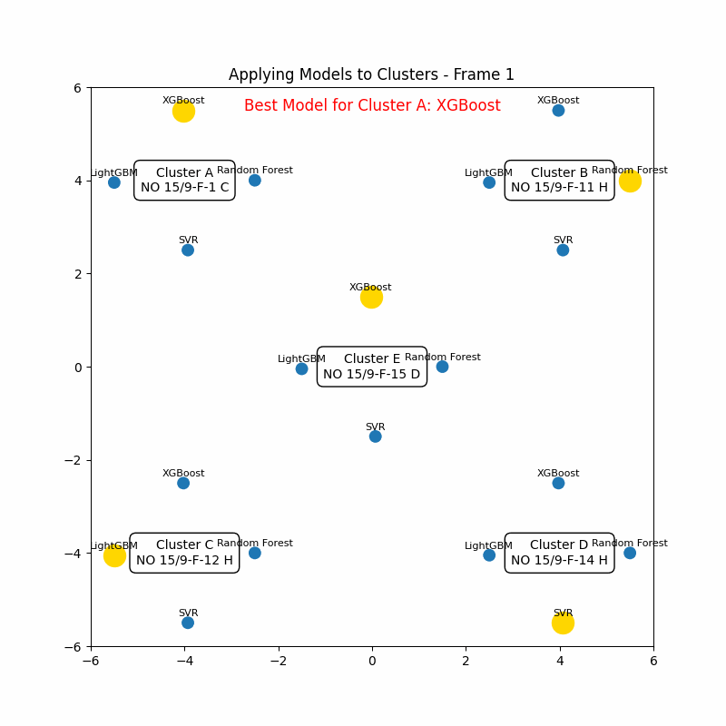

# Predictive-Modeling-of-Oil-Production-Wells-Volve-Dataset-
This project provides a comprehensive Exploratory Data Analysis (EDA) and Machine Learning Modeling pipeline on the Volve Dataset from oil production wells. It identifies relationships between pressure, choke size, and oil production while using advanced techniques like Hyperparameter Tuning and Model Stacking for predictive modeling.

🚀 Project Highlights:
Data Preprocessing:

Removal of outliers using Interquartile Range (IQR).
Encoding of categorical features using LabelEncoder (e.g., WELL_BORE_CODE as clusters).
Identification and removal of zero-value data points in critical features.
Exploratory Data Analysis (EDA):

Correlation Heatmaps to identify relationships between features.

Pairplots for visualizing scatter plots between features and target (BORE_OIL_VOL).

Boxplots and scatter plots to analyze cluster-specific behaviors.

Cluster-Specific Analysis:

Wells were divided into 5 Clusters:

Encoded 0 -> Original Label: NO 15/9-F-1 C
Encoded 1 -> Original Label: NO 15/9-F-11 H
Encoded 2 -> Original Label: NO 15/9-F-12 H
Encoded 3 -> Original Label: NO 15/9-F-14 H
Encoded 4 -> Original Label: NO 15/9-F-15 D

based on the WELL_BORE_CODE feature.
Visualizations revealed dispersed patterns in Cluster 2, prompting further analysis.

Modeling Pipeline:

Implemented multiple regression models (Random Forest, XGBoost, LightGBM, Gradient Boosting, SVR).
Performed K-Fold Cross-Validation to ensure robust performance metrics.
Selected the best-performing model for each cluster based on:
R-squared Score
Mean Absolute Error (MAE)
Root Mean Squared Error (RMSE)
Hyperparameter Tuning:

Applied GridSearchCV to fine-tune LightGBM (Cluster 2) and XGBoost (Cluster 4).
Improved performance metrics significantly.
Stacked Model:

Combined predictions from LightGBM and XGBoost using StackingRegressor.
Demonstrated how model stacking boosts predictive accuracy.
Visualization Animations:

🔑 Key Features:

Outlier Detection and Removal using IQR.

Correlation Analysis to drop redundant features.

Cluster-Specific Modeling to improve predictions for diverse patterns.

Advanced Techniques:

Hyperparameter Tuning

Model Stacking

Cross-Validation

Visual Storytelling:

Scatterplots

Boxplots

Pairplots

📊 Dataset:
Dataset: all_wells.csv (Volve Dataset)
Features:
AVG_DOWNHOLE_PRESSURE: Average pressure in the downhole.
AVG_CHOKE_SIZE_P: Choke size for oil flow regulation.
DP_CHOKE_SIZE: Additional choke size parameter.
AVG_WHT_P: Wellhead temperature.
BORE_OIL_VOL: Target variable – Oil volume produced.
🏆 Results:
Best Models for Each Cluster:

Random Forest, LightGBM, XGBoost, and Stacked Models were evaluated for all clusters.
Metrics (R², MAE, RMSE) were used for comparison.
Stacked Model Performance:

Achieved the highest R-squared: 0.961087 on certain clusters.
Demonstrated model stacking's ability to generalize better for complex relationships.
Insights:

Cluster 2 displayed dispersed data, requiring polynomial features and SVR tuning.

Clusters 3 and 4 had strong predictive accuracy with tree-based models.
